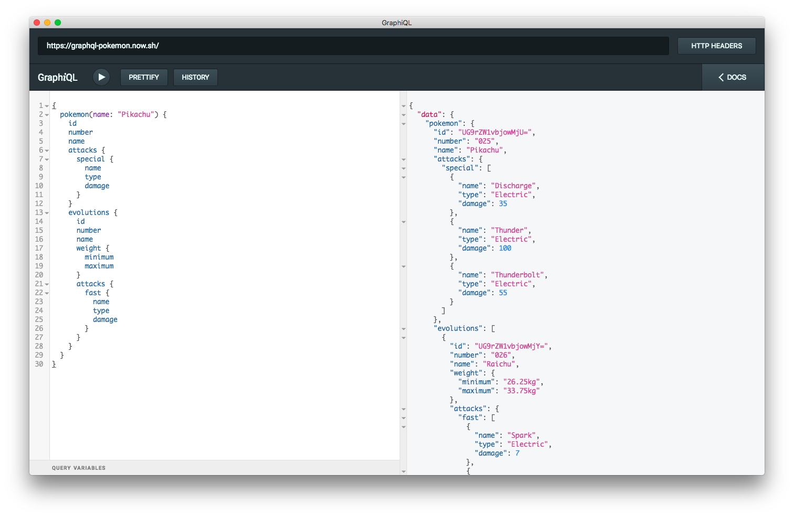
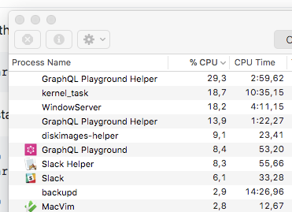

# Graphico (GraphQL Chico)

Yet another [GraphiQL](https://github.com/graphql/graphiql) wrapper using [electron](https://electronjs.org/).

More in the [screenshots](./assets/screenshots) folder.

## But why?

Basically, because I wasn't happy with the style of the existing [GraphiQL app](https://github.com/skevy/graphiql-app) and [GraphQL playground](https://github.com/graphcool/graphql-playground) proved to be too resource intensive for me.

At first I tried editing the *graphiql-app* code, but in the end, since the app it's not very complex and the existing one wasn't extensible enough, I just decided to create my own app.

I also took the chance to improve a bit the default appearance of GraphiQL making some changes. The idea was to be as faithful as possible to the default look and just make it a bit more consistent with a dark theme.

I plan to have support for custom themes and for custom css too in the future.

And of course, this app was a good basis for [graphiql-atom](https://github.com/larsbs/graphiql-atom).

## Installation

Simply download the latest release from the [Releases](https://github.com/larsbs/graphico/releases) tab.

## License

[MIT](LICENSE)
